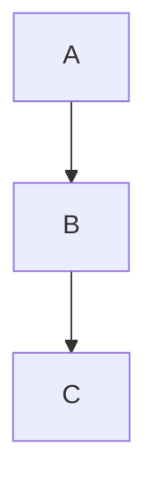

# 内容溢出与空泛预防

Slidev 使用固定画布渲染（默认 980×552px）。超出该区域的内容会被裁切并不可见。本参考不仅定义防溢出边界，也定义防空泛规则：普通内容页必须充分承载观点、证据和解读，不能为了安全而只排半屏。

## Canvas Dimensions

- Default: **980px wide × 552px high** (16:9 at canvasWidth 980)
- Usable area after padding: **~900×480px**
- With `#` title: **~900×420px** remaining for content

## 单页安全区间

| 元素 | 安全区间 | 风险区 |
|------|----------|--------|
| Bullet points（无子项） | standard：4-6；dense：6-8 并分组 | 8+ 未分组易溢出 |
| Bullet points（带描述） | 3-5 条 | 6+ 需卡片化或拆页 |
| Code block lines | 10-12 行可见；12-18 行需 maxHeight | 18+ 通常拆页 |
| Mermaid nodes | 8-10 个，必须显式 scale | 11+ 且未缩放易溢出 |
| Table rows | 5-6 行 | 7+ 需转置、卡片化或拆页 |
| Table columns | 4-5 列 | 6+ 横向拥挤 |
| Grid cards（3 列） | 3 张卡，每张 3 行以内 | 单卡 4+ 行易溢出 |
| Grid cards（2×2） | 4 张卡，每张 3-4 行 | 单卡 5+ 行易溢出 |
| Dense card grid | 4-6 张紧凑卡 | 6+ 需要拆页或合并信息 |
| Two-col content height | 每栏约 250px | 两栏都超过 250px 会溢出 |
| Sequence diagram participants | 4-5 个 | 6+ 横向易溢出 |

## 密度下限

普通内容页默认应为 `standard` 密度，除 cover、TOC、section、quote、end、强视觉 hero 外，不应低于以下任一标准：

- 至少 3 个有效信息块（卡片、证据点、对比项、步骤、影响或行动）。
- 或 1 个主视觉/图表 + 至少 2 个解释/证据/注释块。
- 或 1 个核心结论 + 3 个支撑点。

如果页面只有标题 + 一句短话、一个孤立小卡片，或 1-2 条 bullet 且没有强视觉，应补充证据、案例、权衡、影响、下一步，或与相邻低密度页面合并。

## Fix Techniques

### 1. 分组、卡片化与布局升级（优先）

先通过分组、缩写、卡片化、双栏、hero-top、mixed-grid 或 L-shape 提高承载力。只有在这些方式仍无法保持可读和不溢出时，才拆成多页。

### 2. Zoom（单页缩放）

```yaml
---
zoom: 0.8
---
```

整体缩小 20%。适合略超预算但结构仍清晰的页面。不要低于 0.7，否则文字会难以阅读。

### 3. Code Block Max Height（滚动代码）

````md
```ts {*}{maxHeight:'200px'}
// Long code — scrollable in presentation
function example() {
  // ...many lines...
}
```
````

当长代码对上下文很重要时使用。演示时观众可以滚动查看。

### 4. Mermaid Scale

必须显式设置 scale，不要依赖默认缩放。

````md

````

缩放参考：
- 简单图（3-5 个节点）：`{scale: 0.6}`
- 中等图（6-8 个节点）：`{scale: 0.5}`
- 复杂图（9+ 个节点）：`{scale: 0.45}` 或简化图

### 5. Transform Component（元素级缩放）

```html
<Transform :scale="0.8">
  <div>Large content here</div>
</Transform>
```

适合只缩小某个元素，不影响整页其他内容。

### 6. 拆页（最后手段）

当内容经过分组、卡片化、缩放和容器控制后仍然超过预算，才拆页。拆页后仍需保证每一页满足相应密度，不要把一个充实页面拆成两个空泛页面。

## Dangerous Patterns (Avoid)

### Pattern 1: Code + Diagram + List on Same Slide

BAD — almost always overflows:
```md
# My Slide

- Point 1
- Point 2

​```mermaid
graph TD
    A --> B
​```

​```ts
const x = 1
​```
```

FIX: Split into 2-3 slides, one per element type.

### Pattern 2: Two Columns Both With Code

BAD — code blocks have minimum height:
```md
::left::
​```ts
// 15 lines of code
​```

::right::
​```ts
// 15 lines of code
​```
```

FIX: Use magic-move on a single code block, or split into separate slides.

### Pattern 3: Auto-Generated TOC

BAD for decks with >10 slides:
```md
<Toc minDepth="1" maxDepth="1" />
```

FIX: Hand-craft a summary with 6-8 items in a 2-column grid.

### Pattern 4: Wide Comparison Tables

BAD — 8 rows × 5 columns:
```md
| A | B | C | D | E |
|---|---|---|---|---|
| ... 8 rows ... |
```

FIX: Max 6 rows × 4 columns. Split into 2 tables on separate slides if needed. Abbreviate cell content.

## Self-Check Checklist

After generating a presentation, verify EVERY slide:

- [ ] Bullet count ≤ 6?
- [ ] Code lines ≤ 12 (or has maxHeight)?
- [ ] Mermaid has explicit `{scale: 0.45-0.6}`?
- [ ] Table ≤ 6 rows?
- [ ] Two-col: neither column exceeds ~250px?
- [ ] No triple combo (code + diagram + list)?
- [ ] No `<Toc>` on 10+ slide decks?
