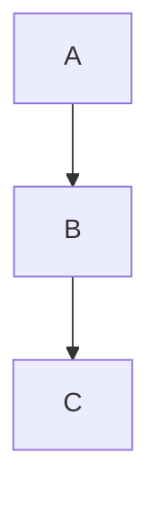

# Content Overflow Prevention

Slidev renders slides on a fixed canvas (default: 980×552px). Content exceeding this area is clipped and invisible. This reference documents hard limits and fix techniques.

## Canvas Dimensions

- Default: **980px wide × 552px high** (16:9 at canvasWidth 980)
- Usable area after padding: **~900×480px**
- With `#` title: **~900×420px** remaining for content

## Hard Limits Per Slide

| Element | Max Safe | Danger Zone |
|---------|----------|-------------|
| Bullet points (no sub-items) | 5-6 | 7+ overflows |
| Bullet points (with descriptions) | 3-4 | 5+ overflows |
| Code block lines | 10-12 | 13+ overflows |
| Mermaid nodes | 8-10 | 11+ overflows without scale |
| Table rows | 5-6 | 7+ overflows |
| Table columns | 4-5 | 6+ causes horizontal squeeze |
| Grid cards (3-col) | 3 cards, 3 lines each | 4+ lines per card overflows |
| Grid cards (2-col) | 4 cards, 4 lines each | 5+ lines per card overflows |
| Two-col content height | ~250px per column | Both cols > 250px overflows |
| Sequence diagram participants | 4-5 | 6+ causes horizontal overflow |

## Fix Techniques

### 1. Split Into Multiple Slides (Preferred)

Always the best solution. Instead of cramming, use a section divider + 2 content slides.

### 2. Zoom (Per-Slide Scaling)

```yaml
---
zoom: 0.8
---
```

Shrinks all content by 20%. Good for slides that are slightly over the limit. Do NOT go below 0.7 — text becomes unreadable.

### 3. Code Block Max Height (Scrollable)

````md
```ts {*}{maxHeight:'200px'}
// Long code — scrollable in presentation
function example() {
  // ...many lines...
}
```
````

Use when showing long code is important for context. Audience can scroll during presentation.

### 4. Mermaid Scale

Always set scale explicitly. NEVER rely on default.

````md

````

Scale guide:
- Simple (3-5 nodes): `{scale: 0.6}`
- Medium (6-8 nodes): `{scale: 0.5}`
- Complex (9+ nodes): `{scale: 0.45}` or simplify the diagram

### 5. Transform Component (Element-Level)

```html
<Transform :scale="0.8">
  <div>Large content here</div>
</Transform>
```

Good for shrinking a specific element without affecting the rest of the slide.

## Dangerous Patterns (Avoid)

### Pattern 1: Code + Diagram + List on Same Slide

BAD — almost always overflows:
```md
# My Slide

- Point 1
- Point 2

​```mermaid
graph TD
    A --> B
​```

​```ts
const x = 1
​```
```

FIX: Split into 2-3 slides, one per element type.

### Pattern 2: Two Columns Both With Code

BAD — code blocks have minimum height:
```md
::left::
​```ts
// 15 lines of code
​```

::right::
​```ts
// 15 lines of code
​```
```

FIX: Use magic-move on a single code block, or split into separate slides.

### Pattern 3: Auto-Generated TOC

BAD for decks with >10 slides:
```md
<Toc minDepth="1" maxDepth="1" />
```

FIX: Hand-craft a summary with 6-8 items in a 2-column grid.

### Pattern 4: Wide Comparison Tables

BAD — 8 rows × 5 columns:
```md
| A | B | C | D | E |
|---|---|---|---|---|
| ... 8 rows ... |
```

FIX: Max 6 rows × 4 columns. Split into 2 tables on separate slides if needed. Abbreviate cell content.

## Self-Check Checklist

After generating a presentation, verify EVERY slide:

- [ ] Bullet count ≤ 6?
- [ ] Code lines ≤ 12 (or has maxHeight)?
- [ ] Mermaid has explicit `{scale: 0.45-0.6}`?
- [ ] Table ≤ 6 rows?
- [ ] Two-col: neither column exceeds ~250px?
- [ ] No triple combo (code + diagram + list)?
- [ ] No `<Toc>` on 10+ slide decks?
