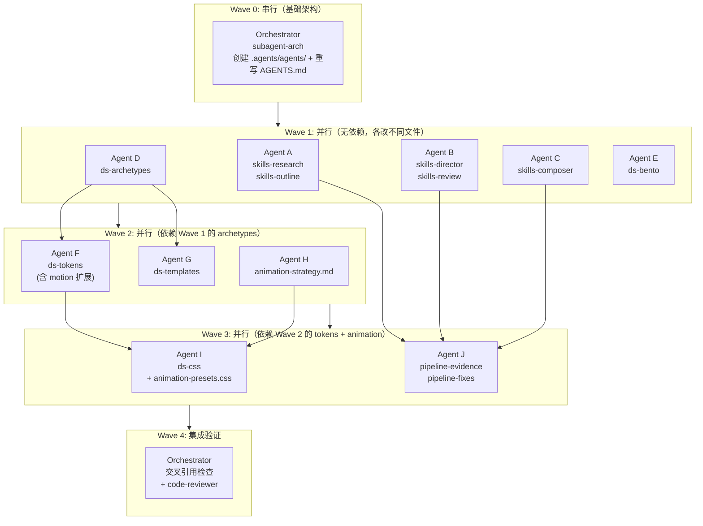

# PPT 质量上限提升方案

## 一、当前质量瓶颈诊断

审计了全部 9 个 Skill（共约 730 行）、完整设计系统（16 个文件）、和 3 套现有 PPT 产出后，核心瓶颈归纳为三层：

### Skills 层：指令太薄，agent 缺少"怎么做好"的深度指导

| Skill | 行数 | 核心问题 |
|-------|------|----------|
| ppt-research | 52 | 无信源质量分级、无搜索策略示例、置信度定义缺失 |
| ppt-design-director | 44 | 仅 2 个 archetype，无决策矩阵，未覆盖可访问性 |
| ppt-outline-architect | 57 | 金字塔原理只"声明"未"教学"，无 worked example |
| ppt-slide-composer | 115 | 图片/表格/边界情况未覆盖，无"内容过密时主动拆页"规则 |
| ppt-review | 113 | 无叙事/CTA 检查，无事实核查对照 research-report |

### 设计系统层：视觉表达力不足

| 模块 | 核心问题 |
|------|----------|
| Archetypes | 仅 `technical-share` 和 `pitch-deck`，缺少培训/汇报/路线图等 |
| Tokens | JSON 与 CSS 变量不对齐，无字体阶梯/阴影/间距系统 |
| Page Templates | 仅 7 个单一变体，缺少指标页/时间线/对比表/FAQ 等 |
| CSS Classes | 无排版阶梯、无图表容器、动画类仅 1 个 |
| Bento Patterns | 概念性描述，无基于 980x552 画布的精确布局 |

### 产出层：现有 PPT 未真正使用设计系统

3 套现有 deck **均未导入** `global-tokens.css` / `page-classes.css`，颜色用 Tailwind 硬编码而非 CSS 变量，跨 deck 无统一视觉家族感。

---

## 二、提升策略


---

## Phase 0: Subagent 架构

### 架构变更总览

当前 harness 是"单 agent 串行"模型，没有角色分工和并行能力。升级为 skill + agent 双层架构：

```
.agents/
├── skills/              # 知识层：每个角色知道什么（已有，保持不变）
│   ├── ppt-research/SKILL.md
│   ├── ppt-slide-composer/SKILL.md
│   └── ...
└── agents/              # 执行层：谁来做、怎么并行（新增）
    ├── researcher.md
    ├── designer.md
    ├── architect.md
    ├── composer.md
    ├── reviewer.md
    └── engineer.md

AGENTS.md                # 调度层：什么时候串行、什么时候并行（重写）
```

**skill 和 agent 的区别：**
- **Skill** = 领域知识（"怎么做调研"、"怎么写 Slidev"）-- 纯指令文档
- **Agent** = 执行角色（"我是 researcher，我用 ppt-research skill，我的输入是 brief，输出是 research-report，我可以并行搜索多个维度"）-- 含输入/输出/并行/文件归属契约

### 0.1 六个 Agent 角色定义

每个 agent 文件统一格式：

```yaml
---
name: <agent-id>
description: <一句话描述>
skills: [<所用 skill 列表>]
inputs: [<输入文件/数据>]
outputs: [<产出文件>]
file_ownership: [<有写权限的文件路径>]
parallelizable: true/false
parallel_strategy: "<并行方式描述>"
---
```

后接 markdown 正文：角色职责、执行步骤、并行细节、输入/输出契约。

#### 六个角色设计

| 文件 | 角色 | Skills | 输入 | 输出 | 可并行 |
|------|------|--------|------|------|--------|
| `researcher.md` | 调研员 | ppt-research | brief | research-report.md | 是：多维度并行搜索 |
| `designer.md` | 设计总监 | ppt-design-director | research-report + design-system | style-plan.md | 否（单决策） |
| `architect.md` | 大纲架构师 | ppt-outline-architect | research-report + style-plan + brief | outline.json | 否（单决策） |
| `composer.md` | 幻灯片编写者 | ppt-slide-composer, slidev | outline + style-plan + design-system | slides-topic.md | 是：按 outline part 并行编写 |
| `reviewer.md` | 质量审查员 | ppt-review | slides + research-report + style-plan | review-report + 修复后 slides | 是：按审查类别并行检查 |
| `engineer.md` | 工程师 | ppt-preview, ppt-publish | slides | preview URL / 发布 URL | 否（构建是串行） |

#### `researcher.md` 核心内容

```markdown
## Parallel Strategy

When the orchestrator supports subagent dispatch (Cursor Task tool / Claude Code Agent Teams):

Spawn one search subtask per dimension from the brief:
- Subtask 1: Market/industry dimension → WebSearch 2-3 queries
- Subtask 2: Competitor/alternative dimension → WebSearch 2-3 queries
- Subtask 3: Audience-specific concerns → WebSearch 2-3 queries
- Subtask 4: Counter-arguments/risks → WebSearch 1-2 queries
- Subtask 5: Technical reality check → WebSearch 1-2 queries

Each subtask returns: { dimension, findings[], sources[] }
Parent merges into single research-report.md with cross-reference dedup.

Fallback (no subagent support): execute dimensions sequentially.
```

#### `composer.md` 核心内容

```markdown
## Parallel Strategy

When outline has 3+ parts and total pages >= 12:

Spawn one composer subtask per outline part:
- Subtask "Part 1": receives part.pages[], style-plan, design-system → writes section markdown
- Subtask "Part 2": same
- ...

Each subtask outputs a markdown fragment with `---` slide separators.
Parent orchestrator:
1. Writes headmatter (theme, fonts, transition, CSS imports)
2. Concatenates part fragments in order
3. Writes cover + TOC + end page (orchestrator handles these directly)
4. Validates page count matches outline

File ownership per subtask: temporary file `artifacts/_part-N.md`
Final merge target: `slides-<topic>.md` (orchestrator only)

Fallback: compose all pages sequentially in one agent.
```

#### `reviewer.md` 核心内容

```markdown
## Parallel Strategy

Spawn parallel review subtasks by category:
- Subtask "overflow": Check all slides for content overflow, Mermaid sizing, code height
- Subtask "narrative": Check CTA, red thread, audience match, key_message alignment
- Subtask "factual": Spot-check 3 claims against research-report.md
- Subtask "animation": Check v-click counts, transition consistency, v-motion visibility
- Subtask "design-system": Check CSS variable usage, page-classes adoption, token alignment

Each subtask returns: { category, issues[], passed: bool }
Parent merges into unified review report, dedup cross-category issues.

Fallback: run all categories sequentially in one checklist pass.
```

### 0.2 AGENTS.md 调度策略重写

当前 `AGENTS.md` 的 "Phases" 部分从纯串行升级为 **自适应调度**：

```markdown
## Orchestration Strategy

### Mode Selection

The orchestrator SHOULD use subagent dispatch when the platform supports it
(Cursor Task tool, Claude Code Agent Teams). When not available, fall back
to sequential single-agent execution. The pipeline phases are the same
regardless of mode.

### Phase Dependency Graph

    Clarify (orchestrator)
        │
        ▼
    Research (researcher agent) ──── can parallelize dimensions
        │
        ▼
    Style Decision (designer agent)
        │
        ▼
    Outline (architect agent)
        │
        ▼
    Compose (composer agent) ──── can parallelize by outline part
        │
        ▼
    Preview (engineer agent)
        │
        ▼
    Review (reviewer agent) ──── can parallelize by check category
        │
        ▼
    Deliver

### Dispatch Rules

1. **Phase 1 (Clarify)**: Always orchestrator. Never delegate -- requires
   user interaction.

2. **Phase 2 (Research)**: Dispatch to researcher agent.
   - Read `.agents/agents/researcher.md` for parallel search strategy.
   - If platform supports parallel subtasks: spawn per-dimension searches.
   - Wait for all subtasks before proceeding.

3. **Phase 3 (Style)**: Dispatch to designer agent. Sequential, depends
   on research-report.md existing.

4. **Phase 4 (Outline)**: Dispatch to architect agent. Sequential, depends
   on research-report.md + style-plan.md.

5. **Phase 5 (Compose)**: Dispatch to composer agent.
   - Read `.agents/agents/composer.md` for parallel part strategy.
   - If outline has 3+ parts AND total pages >= 12: parallelize by part.
   - Orchestrator handles headmatter + cover/TOC/end page.

6. **Phase 6 (Preview)**: Dispatch to engineer agent. Sequential.

7. **Phase 7 (Review)**: Dispatch to reviewer agent.
   - Read `.agents/agents/reviewer.md` for parallel category strategy.
   - If platform supports: spawn per-category review subtasks.

### Subagent Prompt Template

When dispatching a subagent, the orchestrator MUST include:

    You are the [ROLE] agent for this PPT project.

    Read your role definition: .agents/agents/[ROLE].md
    Read your skill(s): .agents/skills/[SKILL]/SKILL.md

    Your inputs (already exist in workspace):
    - [list of input files]

    Your task:
    [specific task description from the phase]

    Write your output to: [output file path]
    Return a summary of what you produced.
```

### 0.3 平台适配

| 平台 | 调度机制 | 适配方式 |
|------|----------|----------|
| Cursor | `Task` tool (`generalPurpose` subagent) | `.cursor/rules/ppt-commands.mdc` 中引用 `.agents/agents/*.md` |
| Claude Code | `Task` tool 或 Agent Teams (`TaskCreate`) | `CLAUDE.md` 指向 `AGENTS.md` 调度策略 |
| Codex | 不支持 subagent | `AGENTS.md` fallback 模式：串行执行 |
| opencode / codebuddy | 通常不支持 | 同上 fallback |

**核心原则**：subagent 是 **可选加速**，不是必须。所有 phase 在单 agent 串行模式下也能完整执行。`.agents/agents/` 中的角色定义对串行模式同样有价值 -- 它们明确了每个 phase 的输入/输出/文件归属契约。

### 0.4 文件归属矩阵

防止 subagent 文件写冲突的核心机制：

| Agent | 可写文件 | 只读文件 |
|-------|----------|----------|
| researcher | `artifacts/research-report.md` | `brief.json` |
| designer | `artifacts/style-plan.md` | `research-report.md`, `design-system/*` |
| architect | `artifacts/outline.json` | `research-report.md`, `style-plan.md`, `schemas/*` |
| composer | `slides-<topic>.md`, `artifacts/_part-*.md` | `outline.json`, `style-plan.md`, `design-system/*` |
| reviewer | `slides-<topic>.md`(fix), `artifacts/review-report.md` | `research-report.md`, `style-plan.md` |
| engineer | `artifacts/*/site/`, `dist/` | `slides-<topic>.md` |

---

## Phase 1: Skills 深化

### 1.1 ppt-research -- 从"搜了就行"到"有章法地调研"

在 [assets/skills/ppt-research/SKILL.md](assets/skills/ppt-research/SKILL.md) 中增加：

- **信源质量阶梯**：学术/官方 > 行业报告 > 头部媒体 > 博客/论坛，要求至少 1 个一级信源
- **搜索策略模板**：每个维度给出 2-3 个 example query（含时间限定、地区限定）
- **置信度定义**：high = 多信源交叉验证，medium = 单一可靠信源，low = 推断/类比
- **矛盾处理规则**：当用户材料与搜索结果矛盾时，必须在 findings 中标注 `[CONFLICT]` 并给出双方证据
- **与 schema 对齐**：显式引用 `schemas/research-report.schema.json` 字段

### 1.2 ppt-design-director -- 从"两个选项"到"矩阵决策"

在 [assets/skills/ppt-design-director/SKILL.md](assets/skills/ppt-design-director/SKILL.md) 中增加：

- **决策矩阵表**：`受众类型 x 场景 x 目标 -> archetype + token + 重点模板`
- **新 archetype 引用**：指向 Phase 2 新增的 5 个 archetype 文件
- **动效策略表**：按页面类型定义 `reveal 密度 / 过渡类型 / 是否 magic-move`
- **可访问性规则**：对比度 >= 4.5:1，提供减少动效替代方案
- **引用 validate-style.js**：完成 style-plan 后调用校验

### 1.3 ppt-outline-architect -- 从"声明金字塔"到"教会金字塔"

在 [assets/skills/ppt-outline-architect/SKILL.md](assets/skills/ppt-outline-architect/SKILL.md) 中增加：

- **Worked example**：一个完整的 3-part 10-page 示例大纲，展示 conclusion-first + MECE + evidence_refs
- **叙事弧对齐规则**：`outline parts 必须映射到 archetype 的 narrativePhases`
- **反对意见页要求**：当 research 含 counter-argument 时，outline 必须有对应的 risk/limitation 页
- **evidence_refs 格式规范**：`维度标签:findings索引`，如 `market:F2`
- **内容密度预估**：每页标注预期 bullet 数 / 代码行数 / 图表类型，供 composer 参考

### 1.4 ppt-slide-composer -- 从"会写 Slidev"到"像设计师一样排版"

在 [assets/skills/ppt-slide-composer/SKILL.md](assets/skills/ppt-slide-composer/SKILL.md) 中增加：

- **主动拆页规则**：`outline 单页 > 6 bullets 或 > 12 行代码 -> 必须拆为 2 slides`
- **图片使用规范**：`max-height: 60%画布`、`object-fit: cover`、必须有 alt-text
- **表格溢出规则**：`> 5 行或 > 4 列 -> text-sm + 精简或拆页`
- **"一页一焦点"原则**：每页只有一个视觉重心（diagram / code / metric / quote），禁止组合两个重元素
- **设计系统强制检查**：`headmatter 必须 import global-tokens.css + page-classes.css`，`禁止裸 hex / 裸 Tailwind 颜色`
- **排版阶梯引用**：指向 Phase 2 新增的 `.ppt-h1` ~ `.ppt-caption` 类

### 1.5 ppt-review -- 从"检查溢出"到"全面质量审查"

在 [assets/skills/ppt-review/SKILL.md](assets/skills/ppt-review/SKILL.md) 中增加：

- **叙事与结构** (新类别)：CTA 是否存在、红线是否贯穿、术语是否匹配受众、outline key_message 是否体现
- **事实核查**：抽查 3 条数据声明，对照 `research-report.md` 原始 findings
- **设计系统一致性**：是否使用 CSS 变量而非硬编码色值、是否使用 page-classes
- **可访问性**：对比度、alt-text、动效数量上限
- **重建对照**：fix 后重建前，对比 fix 内容列表

---

## Phase 2: 设计系统扩展

### 2.1 Token 统一：JSON 驱动 CSS

- 重构 `tokens/*.json` 为 **semantic 结构**：`color.surface.*`、`color.text.*`、`type.scale.*`、`spacing.*`、`shadow.*`、`motion.duration.*`
- 新增 `tokens/corporate-blue.json`（商务蓝）、`tokens/warm-creative.json`（温暖创意）、`tokens/mono-editorial.json`（极简编辑）
- **`global-tokens.css` 必须与 JSON 1:1 对应**，注释标注来源 token name
- 新增字体阶梯 tokens：`--ppt-text-display`(2.5rem)、`--ppt-text-h1`(1.75rem)、`--ppt-text-h2`(1.25rem)、`--ppt-text-body`(0.95rem)、`--ppt-text-caption`(0.75rem)

### 2.2 新增 5 个 Archetypes

| archetype 文件名 | 场景 | narrativePhases |
|------------------|------|-----------------|
| `executive-briefing.yaml` | 高管汇报 | situation -> findings -> recommendation -> ask |
| `training-workshop.yaml` | 培训/教学 | objective -> concept -> demo -> practice -> recap |
| `quarterly-review.yaml` | 季度回顾 | highlights -> metrics -> challenges -> next-quarter |
| `product-launch.yaml` | 产品发布 | problem -> vision -> solution -> demo -> pricing-cta |
| `research-readout.yaml` | 调研汇报 | background -> methodology -> findings -> implications |

每个 archetype 增加：
- `phaseSlideRange`：每个 phase 建议的页数区间
- `templateMapping`：每个 phase 推荐使用的 page-template 列表
- `contentTypes`：每个 phase 期望的内容类型（diagram / quote / KPI / code）

### 2.3 新增 8 个 Page Templates

| 模板 | 用途 |
|------|------|
| `hero-metric.md` | 大数字 + 副标题 + 趋势指示 |
| `timeline.md` | 水平/垂直时间线 |
| `comparison-table.md` | 2-4 列对比表（含高亮推荐列） |
| `image-showcase.md` | 全出血背景图 + 叠加文字 |
| `quote-highlight.md` | 大段引文 + 出处 |
| `team-grid.md` | 头像 + 姓名 + 角色网格 |
| `faq.md` | Q&A 问答格式 |
| `metrics-strip.md` | 3-5 个 KPI 横向排列 |

每个模板提供：light 和 heavy 两个密度变体。

### 2.4 CSS 扩展

在 [assets/design-system/styles/page-classes.css](assets/design-system/styles/page-classes.css) 中增加：

- **排版阶梯**：`.ppt-h1` ~ `.ppt-caption` 对应 token 中的字体尺寸
- **图表/图形容器**：`.diagram-container`（固定宽高比 + max-height + 居中）、`.code-container`（maxHeight + 圆角 + 溢出滚动）
- **卡片变体**：`.glass-card-sm`、`.glass-card-lg`、`.glass-card-accent`
- **指标展示**：`.metric-big`（大数字 + 副标题样式）、`.metric-strip`（flex 横排）
- **表格优化**：`.ppt-table`（适配 Slidev 画布的紧凑表格样式）

在 `animation-presets.css` 中增加：
- `.animate-slide-up`、`.animate-scale-in`、`.animate-blur-in` 共 3 个新动画类
- `@media (prefers-reduced-motion)` 降级方案

### 2.5 Bento Patterns 精确化

重写 [assets/design-system/layouts/bento-patterns.md](assets/design-system/layouts/bento-patterns.md)：

- 所有布局基于 **Slidev 默认画布 980x552px**
- 每个 pattern 附 **ASCII wireframe** + 精确像素/百分比尺寸
- 新增 `L-shape`、`T-shape`、`full-bleed` 三个模式
- 每个 pattern 标注 **安全边距**（上下左右各 40px）和 **适用内容类型**
- 新增 **反模式** 章节：展示 3 个常见布局错误

---

## Phase 2.5: 动画策略专项

### 当前动画瓶颈诊断

审计全部动画相关内容（横跨 12 个文件）后发现 6 个核心问题：

| 问题 | 具体表现 |
|------|----------|
| Token 冲突 | `tech-minimal.json` 默认 `slide-left`，`pitch-modern.json` 默认 `fade-out`，composer 全局规则写死"content = slide-left"，三方互相矛盾 |
| 功能覆盖断层 | composer/review 仅涉及 `v-click` + `v-clicks`，完全未提及 `v-motion`、`v-mark`、`v-after`、`v-switch`、`magic-move`、`[click]` notes |
| 仅 1 个 CSS 动画 | `animation-presets.css` 只有 `.animate-fade-in-up`，无体系化入场/强调/退场动画 |
| 无时间系统 | 没有 duration / easing / stagger tokens，唯一硬编码 0.4s |
| 无叙事节奏 | archetype 仅设 `maxVisualEffectsPerSlide: 2`，无"问题页慢节奏 / 方案页快节奏"的故事驱动动效 |
| 无可访问性 | 无 `prefers-reduced-motion` 降级，无 PDF 导出动画平化说明 |

### 行业最佳实践参考（2026）

从 Slidev 官方文档 + 演示设计行业趋势中提炼的核心原则：

**原则 1：目的优先于装饰**
- 每个动画必须服务于理解（progressive disclosure），不服务理解的动画就是噪音
- 只需 4 种核心动画：Fade In（主力渐显）、Morph/Magic-Move（代码/元素变形）、Appear（即时出现）、Emphasis（v-mark 强调）

**原则 2：时间与节奏**
- 商务演示：0.25-0.50s duration
- 渐进揭示：0.5-0.75s duration
- 禁止 < 0.2s（太快看不到）或 > 1.5s（观众失去耐心）
- 叙事三幕节奏：Setup(慢) -> Evidence(中) -> Resolution(快)

**原则 3：渐进揭示的正确用法**
- 每步揭示必须增加有意义的上下文，不是"让观众等子弹点一个个爬出来"
- 3 项以下列表：全部同时显示，不做 v-clicks
- 单元素页面：不对唯一元素做 v-click

**原则 4：2026 趋势 -- 无演讲者可用**
- 很多 deck 会被观众在手机/电脑上独立查看，动画必须在无演讲者时也能传达信息
- 导出 PDF 时动画被平化，关键信息不能依赖动画顺序

### 2.5.1 新增 `animation-strategy.md` 最佳实践文档

在 `assets/design-system/` 下新建 [assets/design-system/animation-strategy.md](assets/design-system/animation-strategy.md)，作为动画领域的单一权威参考：

**文档结构：**

- **Slidev 动画功能矩阵**：完整列出所有可用动画机制，标注使用场景和限制

| 功能 | 语法 | 适用场景 | 限制 |
|------|------|----------|------|
| `v-click` | `<div v-click>` | 逐步揭示内容块 | 每页 max 2 个 |
| `v-clicks` | `<v-clicks>` 包裹列表 | 列表/表格逐行揭示 | 仅 > 3 项时使用 |
| `v-after` | `<div v-after>` | 与前一个 click 同时出现 | 用于辅助元素 |
| `v-switch` | `<v-switch>` + `#1`/`#2` | 同位置切换不同内容 | 对比/before-after |
| `v-motion` | `v-motion :initial :enter` | 元素入场动效（位移/缩放/透明度） | 仅用于关键视觉焦点 |
| `v-mark` | `v-mark.underline.orange` | 文字强调标记 | 颜色必须使用 token 对应色 |
| `magic-move` | ```` ```md magic-move ```` | 代码块之间变形过渡 | 仅用于代码演示页 |
| `[click]` notes | `<!-- [click] -->` | 演讲备注同步标记 | 仅演讲模式可见 |
| transitions | frontmatter `transition:` | 页间过渡 | 见过渡决策树 |

- **过渡类型决策树**：根据页面类型自动选择过渡

```
封面/结尾 -> fade
章节分隔页 -> fade
目录页 -> fade-out
内容页（默认）-> 跟随 token.motion.transition
代码演示页 -> slide-left
对比/切换页 -> view-transition（如支持）
```

- **叙事节奏模型**：将 archetype 的 narrativePhases 映射到动画密度

| 叙事阶段 | 动画密度 | reveal 速度 | 典型手法 |
|----------|----------|-------------|----------|
| 开场/背景铺垫 | 低 | 慢(0.6s+) | fade 为主，少量 v-click |
| 问题/痛点 | 中 | 中(0.4s) | v-clicks 逐步暴露问题 |
| 方案/架构 | 高 | 中(0.4s) | v-motion 入场 + magic-move 代码 |
| 演示/证据 | 高 | 快(0.3s) | magic-move + v-mark 强调 |
| 总结/CTA | 低 | 慢(0.5s) | fade 收束，核心信息全显 |

- **Token 冲突解决规则**（优先级从高到低）：
  1. `style-plan.md` 中 agent 的显式决策
  2. `token.motion.transition`（archetype 对应的 token 默认值）
  3. 页面类型覆盖规则（封面/章节 = fade，代码页 = slide-left）
  4. `animation-presets.css` 中的全局兜底

- **可访问性与导出**：
  - 所有 CSS 动画必须包含 `@media (prefers-reduced-motion: reduce)` 降级（duration: 0, opacity 直接切换）
  - PDF 导出注意事项：关键信息不能仅通过 v-click 顺序传达，每页最终状态必须完整可读
  - `v-motion` 元素的初始位置必须在可视区内（避免 motion 失败时元素不可见）

### 2.5.2 重写 `animation-presets.css`

将 [assets/design-system/styles/animation-presets.css](assets/design-system/styles/animation-presets.css) 从"1 个动画 + 注释策略"升级为完整的动画工具库：

**新增 CSS 内容：**

- **时间 tokens**：`--ppt-duration-fast: 0.25s`、`--ppt-duration-normal: 0.4s`、`--ppt-duration-slow: 0.6s`、`--ppt-easing: cubic-bezier(0.16, 1, 0.3, 1)`
- **入场动画**（4 个）：`.animate-fade-in`、`.animate-fade-in-up`（保留）、`.animate-slide-up`、`.animate-scale-in`
- **强调动画**（2 个）：`.animate-pulse-subtle`、`.animate-highlight-flash`
- **退场动画**（1 个）：`.animate-fade-out`
- **reduced-motion 全局降级**：`@media (prefers-reduced-motion: reduce)` 中将所有 `.animate-*` 的 `animation-duration` 设为 `0.01s`

### 2.5.3 Token 动效字段扩展

在 Phase 2.1 的 Token 重构中，将 `motion` 从当前的 2 个字段扩展为：

```json
{
  "motion": {
    "maxRevealPerSlide": 2,
    "transition": "slide-left",
    "duration": {
      "fast": "0.25s",
      "normal": "0.4s",
      "slow": "0.6s"
    },
    "easing": "cubic-bezier(0.16, 1, 0.3, 1)",
    "narrativePacing": {
      "setup": "slow",
      "evidence": "normal",
      "resolution": "fast"
    }
  }
}
```

### 2.5.4 更新 Skills 中的动画指令

**ppt-design-director SKILL** -- 在 1.2 的动效策略表基础上，增加：
- 引用 `animation-strategy.md` 作为动画决策的权威来源
- `style-plan.md` 输出格式增加 `animationPolicy.defaultTransition` 和 `animationPolicy.narrativePacing` 字段

**ppt-slide-composer SKILL** -- 在 1.4 基础上，增加：
- **动画功能选择指南**：何时用 `v-click` vs `v-motion` vs `magic-move` vs `v-mark`
- **magic-move 使用规则**：仅用于代码演示页，最多 3 步变形，每步代码差异 <= 30%
- **v-mark 颜色约束**：仅使用 `v-mark.{underline|circle|highlight}.{orange|green|red}`，颜色必须与 token accent 对应
- **presenter notes `[click]` 同步**：每个 v-click 对应的 notes 中必须有 `[click]` 标记

**ppt-review SKILL** -- 在 1.5 基础上，增加：
- **动画审查扩展项**：
  - `v-motion` 初始位置是否在画布可视区内
  - `magic-move` 步数是否 <= 3
  - `v-mark` 颜色是否匹配 token accent
  - frontmatter `transition:` 是否符合决策树
  - presenter notes 中 `[click]` 数量是否匹配页面 v-click 数量

---

## Phase 3: 质量管线强化

### 3.1 证据链贯穿

在整个 pipeline 中建立 `research -> outline -> slides -> review` 的可追溯链：

- **research SKILL**：每个 finding 分配 ID（`F1`、`F2`...）
- **outline SKILL**：每页的 `evidence_refs` 引用 finding ID
- **composer SKILL**：每页末尾 presenter notes 标注引用了哪些 evidence
- **review SKILL**：抽查 3 条，验证 slides 中的声明可以追溯到 research findings

### 3.2 validate-style.js 集成

- 在 **design-director** 和 **review** skill 中显式要求调用 `node scripts/validate-style.js`
- 扩展校验规则：检查 slides markdown 中是否存在裸 hex 色值（应用 CSS 变量）

### 3.3 Slidev SKILL 修正

在 [assets/skills/slidev/SKILL.md](assets/skills/slidev/SKILL.md) 中：

- 修复自检列表编号跳跃（3 -> 6 -> 4 的错误）
- 新增 Slidev 版本锚定声明：`Compatible with @slidev/cli ^52.0.0`
- 统一示例中的包管理器为 `npx`（当前混用 `pnpm`）

---

## 三、预期效果

---

## 四、Subagent 并行执行策略

### 为什么用 Subagent

当前 14 个 todo 如果串行执行，每个平均 10-15 分钟，总计需要 2.5-3.5 小时。但分析依赖关系后发现，大部分任务操作的是 **不同文件**，天然可并行。采用 subagent 波次执行（基于 Phase 0 建立的架构），总时间可压缩到 **约 50 分钟**。

Phase 0 (subagent 架构定义) 必须最先串行执行，因为后续 Wave 的 agent prompt 会引用 `.agents/agents/*.md` 中定义的角色和契约。

### 依赖关系图



### Wave 设计详解

#### Wave 1: 5 个并行 subagent（预计 15 min）

所有任务操作 **不同文件**，零冲突。

| Agent | Todo IDs | 改动文件 | 为什么合并 |
|-------|----------|----------|-----------|
| Agent A | skills-research + skills-outline | `ppt-research/SKILL.md` + `ppt-outline-architect/SKILL.md` | 都是内容管线上游，evidence_refs 格式需对齐 |
| Agent B | skills-director + skills-review | `ppt-design-director/SKILL.md` + `ppt-review/SKILL.md` | director 的输出就是 review 的检查对象，同一人写保证一致性 |
| Agent C | skills-composer | `ppt-slide-composer/SKILL.md` | 最大的单文件改动（+排版+拆页+图片+动画），独占一个 agent |
| Agent D | ds-archetypes | `archetypes/*.yaml`（5 个新文件） | 纯新建文件，无依赖 |
| Agent E | ds-bento | `layouts/bento-patterns.md` | 单文件重写，无依赖 |

**每个 agent 的 prompt 结构：**
1. 读取当前文件内容
2. 读取 plan 中对应章节的详细规格
3. 读取相关参考文件（如 schema、现有 archetype 作为格式参考）
4. 执行编辑
5. 返回改动摘要

#### Wave 2: 3 个并行 subagent（预计 15 min）

依赖 Wave 1 产出的 archetypes（用于 token 的 archetype 引用和 template 的 phaseMapping）。

| Agent | Todo IDs | 改动文件 | 依赖 |
|-------|----------|----------|------|
| Agent F | ds-tokens（含 motion 扩展 2.5.3） | `tokens/*.json`（重构 2 个 + 新建 3 个）+ `global-tokens.css` | Wave 1 的 archetypes（引用 archetype name） |
| Agent G | ds-templates | `page-templates/*.md`（8 个新文件） | Wave 1 的 archetypes（templateMapping 参考） |
| Agent H | animation-strategy（2.5.1） | 新建 `animation-strategy.md` | Wave 1 的 composer SKILL（避免矛盾） |

#### Wave 3: 2 个并行 subagent（预计 10 min）

| Agent | Todo IDs | 改动文件 | 依赖 |
|-------|----------|----------|------|
| Agent I | ds-css + animation-presets（2.5.2） | `page-classes.css` + `animation-presets.css` | Wave 2 的 tokens（CSS 变量名 + 时间 token） + animation-strategy |
| Agent J | pipeline-evidence + pipeline-fixes | 多个 SKILL.md（追加 evidence 链条）+ `slidev/SKILL.md` 修正 | Wave 1 的 5 个 skill 改动（在此基础上追加） |

#### Wave 4: Orchestrator 集成验证（预计 5 min）

主 agent 自己执行：
- 交叉引用检查：skill 中引用的文件路径是否都存在
- Token JSON key 与 CSS 变量名 1:1 校验
- animation-strategy.md 中的规则与 composer/review SKILL 无矛盾
- 运行 `node scripts/validate-outline.js` 和 `node scripts/validate-style.js` 确认脚本正常

### Subagent 类型选择

| Agent | subagent_type | 理由 |
|-------|---------------|------|
| A-E (Wave 1) | `generalPurpose` | 需要读取多个文件 + 写入文件，非只读 |
| F-H (Wave 2) | `generalPurpose` | 同上 |
| I-J (Wave 3) | `generalPurpose` | 同上 |
| Wave 4 验证 | orchestrator 自身 | 轻量检查，不需要单独 subagent |

### 与串行执行的对比

| | 串行执行 | Subagent 并行 |
|--|---------|--------------|
| 总耗时 | ~150 min（13 任务 x ~12 min） | ~45 min（4 波 x ~12 min） |
| 一致性风险 | 低（一个 agent 全局上下文） | 中（需要 Wave 间传递上下文） |
| 缓解策略 | -- | 每个 agent prompt 包含完整规格 + 相关文件内容；Wave 4 做交叉校验 |
| 适用场景 | 任务少或依赖链长 | 任务多且大部分操作不同文件 |

### 执行时的关键约束

1. **同一文件不分给不同 Wave 1 agent** -- 避免写冲突（已在分组中保证）
2. **Wave 2 启动前必须等 Wave 1 全部完成** -- agent F/G/H 需要读取 Wave 1 产出
3. **每个 agent 的 prompt 必须自包含** -- 包含 plan 相关章节全文 + 要编辑的文件当前内容 + 格式参考文件
4. **Wave 4 是 quality gate** -- 发现问题则局部修复，不重跑整波

---

## 五、预期效果

| 维度 | 当前 | 目标 |
|------|------|------|
| Skills 指令深度 | 平均 ~70 行，概要级 | 平均 ~150 行，含示例+边界规则 |
| Archetypes | 2 个（技术分享/路演） | 7 个，覆盖主流商业场景 |
| Token 集 | 2 套浅层 JSON | 5 套语义化 JSON，与 CSS 1:1 对齐 |
| Page Templates | 7 个单一变体 | 15 个，每个含 light/heavy 密度变体 |
| CSS 工具类 | 8 个基础类 + 1 个动画 | 20+ 类 + 7 个动画 + reduced-motion 降级 |
| 动画策略 | 碎片化散落 12 个文件，仅覆盖 v-click | 单一权威文档 + 功能矩阵覆盖全部 8 种 Slidev 动画机制 |
| 动效 Token | 2 字段（transition + maxReveal） | 完整时间系统（duration/easing/narrativePacing） |
| Token 冲突 | tech-minimal vs pitch-modern vs composer 三方矛盾 | 明确优先级链：style-plan > token > 页面类型规则 > 兜底 |
| 质量追溯 | 无 | research finding ID 贯穿到 review |
| 设计系统实际使用率 | 0%（现有 deck 未导入） | 100%（composer 强制要求导入） |
