# PPT 质量上限提升方案

## 一、当前质量瓶颈诊断

审计了全部 9 个 Skill（共约 730 行）、完整设计系统（16 个文件）、和 3 套现有 PPT 产出后，核心瓶颈归纳为三层：

### Skills 层：指令太薄，agent 缺少"怎么做好"的深度指导

| Skill | 行数 | 核心问题 |
|-------|------|----------|
| ppt-research | 52 | 无信源质量分级、无搜索策略示例、置信度定义缺失 |
| ppt-design-director | 44 | 仅 2 个 archetype，无决策矩阵，未覆盖可访问性 |
| ppt-outline-architect | 57 | 金字塔原理只"声明"未"教学"，无 worked example |
| ppt-slide-composer | 115 | 图片/表格/边界情况未覆盖，无"内容过密时主动拆页"规则 |
| ppt-review | 113 | 无叙事/CTA 检查，无事实核查对照 research-report |

### 设计系统层：视觉表达力不足

| 模块 | 核心问题 |
|------|----------|
| Archetypes | 仅 `technical-share` 和 `pitch-deck`，缺少培训/汇报/路线图等 |
| Tokens | JSON 与 CSS 变量不对齐，无字体阶梯/阴影/间距系统 |
| Page Templates | 仅 7 个单一变体，缺少指标页/时间线/对比表/FAQ 等 |
| CSS Classes | 无排版阶梯、无图表容器、动画类仅 1 个 |
| Bento Patterns | 概念性描述，无基于 980x552 画布的精确布局 |

### 产出层：现有 PPT 未真正使用设计系统

3 套现有 deck **均未导入** `global-tokens.css` / `page-classes.css`，颜色用 Tailwind 硬编码而非 CSS 变量，跨 deck 无统一视觉家族感。

---

## 二、提升策略

```mermaid
flowchart LR
  subgraph phase1 [Phase 1: Skills 深化]
    R["ppt-research\n信源质量+搜索策略"]
    D["ppt-design-director\n决策矩阵+新 archetype"]
    O["ppt-outline-architect\nworked example+叙事弧"]
    C["ppt-slide-composer\n密度拆页+图片规则"]
    V["ppt-review\n叙事检查+事实核查"]
  end

  subgraph phase2 [Phase 2: 设计系统扩展]
    T["Tokens 统一\nJSON驱动CSS"]
    A["新 Archetypes\n+5 场景"]
    P["新 Page Templates\n+8 模板"]
    S["CSS 扩展\n排版阶梯+容器"]
    B["Bento 精确化\n画布级像素规格"]
  end

  subgraph phase3 [Phase 3: 质量管线]
    TR["证据链贯穿\nresearch->outline->slide->review"]
    VS["validate-style 集成"]
    SC["Slidev SKILL 修复\n编号typo+版本锚定"]
  end

  phase1 --> phase2 --> phase3
```

---

## Phase 1: Skills 深化

### 1.1 ppt-research -- 从"搜了就行"到"有章法地调研"

在 [assets/skills/ppt-research/SKILL.md](assets/skills/ppt-research/SKILL.md) 中增加：

- **信源质量阶梯**：学术/官方 > 行业报告 > 头部媒体 > 博客/论坛，要求至少 1 个一级信源
- **搜索策略模板**：每个维度给出 2-3 个 example query（含时间限定、地区限定）
- **置信度定义**：high = 多信源交叉验证，medium = 单一可靠信源，low = 推断/类比
- **矛盾处理规则**：当用户材料与搜索结果矛盾时，必须在 findings 中标注 `[CONFLICT]` 并给出双方证据
- **与 schema 对齐**：显式引用 `schemas/research-report.schema.json` 字段

### 1.2 ppt-design-director -- 从"两个选项"到"矩阵决策"

在 [assets/skills/ppt-design-director/SKILL.md](assets/skills/ppt-design-director/SKILL.md) 中增加：

- **决策矩阵表**：`受众类型 x 场景 x 目标 -> archetype + token + 重点模板`
- **新 archetype 引用**：指向 Phase 2 新增的 5 个 archetype 文件
- **动效策略表**：按页面类型定义 `reveal 密度 / 过渡类型 / 是否 magic-move`
- **可访问性规则**：对比度 >= 4.5:1，提供减少动效替代方案
- **引用 validate-style.js**：完成 style-plan 后调用校验

### 1.3 ppt-outline-architect -- 从"声明金字塔"到"教会金字塔"

在 [assets/skills/ppt-outline-architect/SKILL.md](assets/skills/ppt-outline-architect/SKILL.md) 中增加：

- **Worked example**：一个完整的 3-part 10-page 示例大纲，展示 conclusion-first + MECE + evidence_refs
- **叙事弧对齐规则**：`outline parts 必须映射到 archetype 的 narrativePhases`
- **反对意见页要求**：当 research 含 counter-argument 时，outline 必须有对应的 risk/limitation 页
- **evidence_refs 格式规范**：`维度标签:findings索引`，如 `market:F2`
- **内容密度预估**：每页标注预期 bullet 数 / 代码行数 / 图表类型，供 composer 参考

### 1.4 ppt-slide-composer -- 从"会写 Slidev"到"像设计师一样排版"

在 [assets/skills/ppt-slide-composer/SKILL.md](assets/skills/ppt-slide-composer/SKILL.md) 中增加：

- **主动拆页规则**：`outline 单页 > 6 bullets 或 > 12 行代码 -> 必须拆为 2 slides`
- **图片使用规范**：`max-height: 60%画布`、`object-fit: cover`、必须有 alt-text
- **表格溢出规则**：`> 5 行或 > 4 列 -> text-sm + 精简或拆页`
- **"一页一焦点"原则**：每页只有一个视觉重心（diagram / code / metric / quote），禁止组合两个重元素
- **设计系统强制检查**：`headmatter 必须 import global-tokens.css + page-classes.css`，`禁止裸 hex / 裸 Tailwind 颜色`
- **排版阶梯引用**：指向 Phase 2 新增的 `.ppt-h1` ~ `.ppt-caption` 类

### 1.5 ppt-review -- 从"检查溢出"到"全面质量审查"

在 [assets/skills/ppt-review/SKILL.md](assets/skills/ppt-review/SKILL.md) 中增加：

- **叙事与结构** (新类别)：CTA 是否存在、红线是否贯穿、术语是否匹配受众、outline key_message 是否体现
- **事实核查**：抽查 3 条数据声明，对照 `research-report.md` 原始 findings
- **设计系统一致性**：是否使用 CSS 变量而非硬编码色值、是否使用 page-classes
- **可访问性**：对比度、alt-text、动效数量上限
- **重建对照**：fix 后重建前，对比 fix 内容列表

---

## Phase 2: 设计系统扩展

### 2.1 Token 统一：JSON 驱动 CSS

- 重构 `tokens/*.json` 为 **semantic 结构**：`color.surface.*`、`color.text.*`、`type.scale.*`、`spacing.*`、`shadow.*`、`motion.duration.*`
- 新增 `tokens/corporate-blue.json`（商务蓝）、`tokens/warm-creative.json`（温暖创意）、`tokens/mono-editorial.json`（极简编辑）
- **`global-tokens.css` 必须与 JSON 1:1 对应**，注释标注来源 token name
- 新增字体阶梯 tokens：`--ppt-text-display`(2.5rem)、`--ppt-text-h1`(1.75rem)、`--ppt-text-h2`(1.25rem)、`--ppt-text-body`(0.95rem)、`--ppt-text-caption`(0.75rem)

### 2.2 新增 5 个 Archetypes

| archetype 文件名 | 场景 | narrativePhases |
|------------------|------|-----------------|
| `executive-briefing.yaml` | 高管汇报 | situation -> findings -> recommendation -> ask |
| `training-workshop.yaml` | 培训/教学 | objective -> concept -> demo -> practice -> recap |
| `quarterly-review.yaml` | 季度回顾 | highlights -> metrics -> challenges -> next-quarter |
| `product-launch.yaml` | 产品发布 | problem -> vision -> solution -> demo -> pricing-cta |
| `research-readout.yaml` | 调研汇报 | background -> methodology -> findings -> implications |

每个 archetype 增加：
- `phaseSlideRange`：每个 phase 建议的页数区间
- `templateMapping`：每个 phase 推荐使用的 page-template 列表
- `contentTypes`：每个 phase 期望的内容类型（diagram / quote / KPI / code）

### 2.3 新增 8 个 Page Templates

| 模板 | 用途 |
|------|------|
| `hero-metric.md` | 大数字 + 副标题 + 趋势指示 |
| `timeline.md` | 水平/垂直时间线 |
| `comparison-table.md` | 2-4 列对比表（含高亮推荐列） |
| `image-showcase.md` | 全出血背景图 + 叠加文字 |
| `quote-highlight.md` | 大段引文 + 出处 |
| `team-grid.md` | 头像 + 姓名 + 角色网格 |
| `faq.md` | Q&A 问答格式 |
| `metrics-strip.md` | 3-5 个 KPI 横向排列 |

每个模板提供：light 和 heavy 两个密度变体。

### 2.4 CSS 扩展

在 [assets/design-system/styles/page-classes.css](assets/design-system/styles/page-classes.css) 中增加：

- **排版阶梯**：`.ppt-h1` ~ `.ppt-caption` 对应 token 中的字体尺寸
- **图表/图形容器**：`.diagram-container`（固定宽高比 + max-height + 居中）、`.code-container`（maxHeight + 圆角 + 溢出滚动）
- **卡片变体**：`.glass-card-sm`、`.glass-card-lg`、`.glass-card-accent`
- **指标展示**：`.metric-big`（大数字 + 副标题样式）、`.metric-strip`（flex 横排）
- **表格优化**：`.ppt-table`（适配 Slidev 画布的紧凑表格样式）

在 `animation-presets.css` 中增加：
- `.animate-slide-up`、`.animate-scale-in`、`.animate-blur-in` 共 3 个新动画类
- `@media (prefers-reduced-motion)` 降级方案

### 2.5 Bento Patterns 精确化

重写 [assets/design-system/layouts/bento-patterns.md](assets/design-system/layouts/bento-patterns.md)：

- 所有布局基于 **Slidev 默认画布 980x552px**
- 每个 pattern 附 **ASCII wireframe** + 精确像素/百分比尺寸
- 新增 `L-shape`、`T-shape`、`full-bleed` 三个模式
- 每个 pattern 标注 **安全边距**（上下左右各 40px）和 **适用内容类型**
- 新增 **反模式** 章节：展示 3 个常见布局错误

---

## Phase 3: 质量管线强化

### 3.1 证据链贯穿

在整个 pipeline 中建立 `research -> outline -> slides -> review` 的可追溯链：

- **research SKILL**：每个 finding 分配 ID（`F1`、`F2`...）
- **outline SKILL**：每页的 `evidence_refs` 引用 finding ID
- **composer SKILL**：每页末尾 presenter notes 标注引用了哪些 evidence
- **review SKILL**：抽查 3 条，验证 slides 中的声明可以追溯到 research findings

### 3.2 validate-style.js 集成

- 在 **design-director** 和 **review** skill 中显式要求调用 `node scripts/validate-style.js`
- 扩展校验规则：检查 slides markdown 中是否存在裸 hex 色值（应用 CSS 变量）

### 3.3 Slidev SKILL 修正

在 [assets/skills/slidev/SKILL.md](assets/skills/slidev/SKILL.md) 中：

- 修复自检列表编号跳跃（3 -> 6 -> 4 的错误）
- 新增 Slidev 版本锚定声明：`Compatible with @slidev/cli ^52.0.0`
- 统一示例中的包管理器为 `npx`（当前混用 `pnpm`）

---

## 三、预期效果

| 维度 | 当前 | 目标 |
|------|------|------|
| Skills 指令深度 | 平均 ~70 行，概要级 | 平均 ~150 行，含示例+边界规则 |
| Archetypes | 2 个（技术分享/路演） | 7 个，覆盖主流商业场景 |
| Token 集 | 2 套浅层 JSON | 5 套语义化 JSON，与 CSS 1:1 对齐 |
| Page Templates | 7 个单一变体 | 15 个，每个含 light/heavy 密度变体 |
| CSS 工具类 | 8 个基础类 + 1 个动画 | 20+ 类 + 4 个动画 + 减少动效兜底 |
| 质量追溯 | 无 | research finding ID 贯穿到 review |
| 设计系统实际使用率 | 0%（现有 deck 未导入） | 100%（composer 强制要求导入） |
