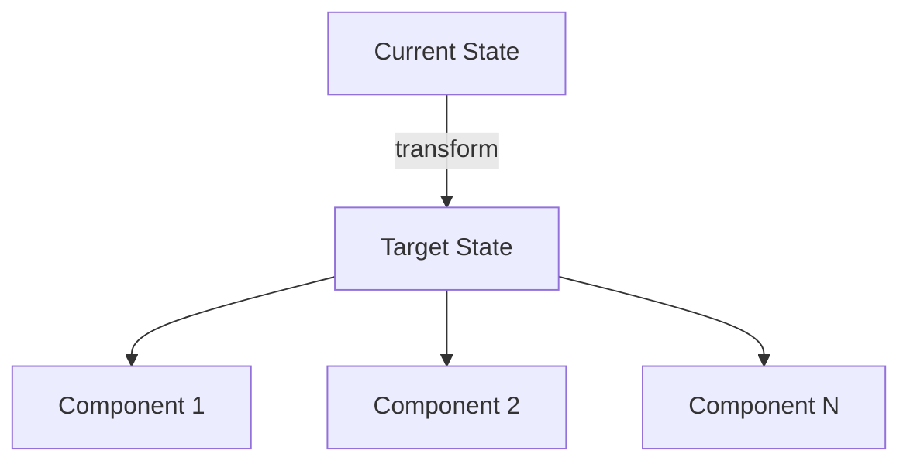

# Page Template: Content Split (Left Text + Right Diagram)

Design intent: Left side stacks 2-3 content cards for narrative depth. Right side shows architecture/diagram for visual clarity.

```md
---
transition: slide-left
---

<div class="section-bar">

# 1. 章节标题

</div>

<div class="grid grid-cols-2 gap-6 mt-6">
<div class="flex flex-col gap-4">

<div v-click class="glass-card">
  <div class="flex items-center gap-3 mb-3">
    <div class="icon-box"><mdi-account-group class="text-base" /></div>
    <div class="font-semibold">要点标题</div>
  </div>
  <div class="text-sm text-[#C7C9D9]">
    由 <strong class="text-[#2DD4BF]">关键词</strong> 驱动的核心论述，
    简要阐述背景和意义。
  </div>
</div>

<div v-click class="glass-card">
  <div class="flex items-center gap-3 mb-3">
    <div class="icon-box"><mdi-lightbulb-outline class="text-base" /></div>
    <div class="font-semibold">核心理念</div>
  </div>
  <div class="text-sm text-[#C7C9D9]">
    实现从"现状"向 <strong class="text-[#2DD4BF]">"目标状态"</strong> 的转变。
  </div>
</div>

</div>
<div>

<div class="text-xs text-[#6B7280] tracking-wider mb-3">· ARCHITECTURE OVERVIEW</div>



</div>
</div>

<!--
演讲者备注：先介绍左侧要点，再用右侧图表佐证。
-->
```
