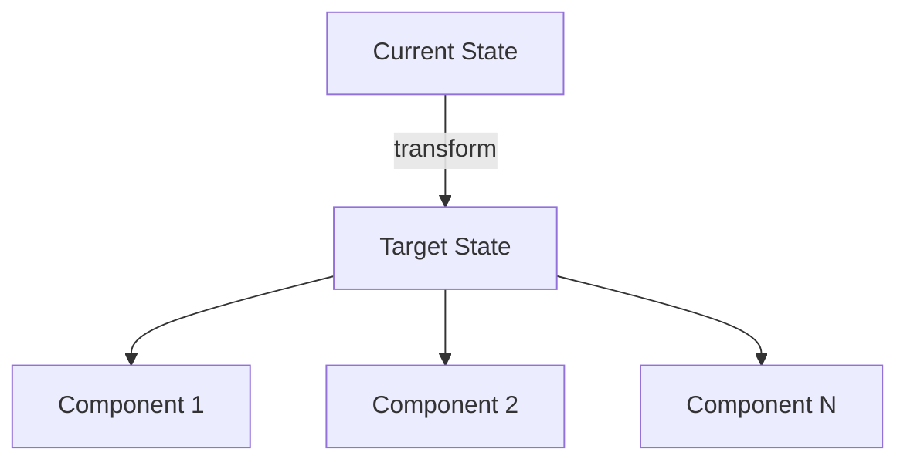

# Page Template: Content Split (Left Text + Right Diagram)

Design intent: Left side stacks 2-3 content cards. Right side shows diagram. Uses CSS variables for dark/light mode.

```md
---
transition: slide-left
---

<div class="section-bar">

# 1. 章节标题

</div>

<div class="grid grid-cols-2 gap-6 mt-6">
<div class="flex flex-col gap-4">

<div v-click class="glass-card">
  <div class="flex items-center gap-3 mb-3">
    <div class="icon-box"><mdi-account-group class="text-base" /></div>
    <div class="font-semibold" style="color:var(--ppt-text)">要点标题</div>
  </div>
  <div class="text-sm" style="color:var(--ppt-text-body)">
    由 <strong class="accent-text">关键词</strong> 驱动的核心论述，
    简要阐述背景和意义。
  </div>
</div>

<div v-click class="glass-card">
  <div class="flex items-center gap-3 mb-3">
    <div class="icon-box"><mdi-lightbulb-outline class="text-base" /></div>
    <div class="font-semibold" style="color:var(--ppt-text)">核心理念</div>
  </div>
  <div class="text-sm" style="color:var(--ppt-text-body)">
    实现从"现状"向 <strong class="accent-text">"目标状态"</strong> 的转变。
  </div>
</div>

</div>
<div>

<div class="text-xs tracking-wider mb-3" style="color:var(--ppt-text-muted)">· ARCHITECTURE OVERVIEW</div>



</div>
</div>

<!--
演讲者备注：先介绍左侧要点，再用右侧图表佐证。
-->
```
